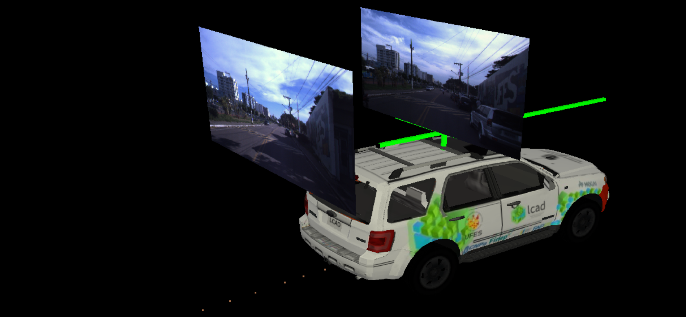

# Visual Global Localization with a Hybrid WNN-CNN Approach
[Avelino Forechi](http://www.linkedin.com/in/forechi), [Thiago Oliveira-Santos](http://www.inf.ufes.br/~todsantos), [Claudine Badue](http://www.inf.ufes.br/~claudine/) and [Alberto F. De Souza](http://inf.ufes.br/~alberto)

<p align="center">
  
</p>

Published in [IJCNN](https://www.ijcnn.org/) 2018 Conference.
A preprint version can be accessed [here](https://arxiv.org/abs/1805.03183).

## Abstract

Currently, self-driving cars rely greatly on the Global Positioning System (GPS) infrastructure, albeit there is an increasing demand for alternative methods for GPS-denied environments. One of them is known as place recognition, which associates images of places with their corresponding positions. We previously proposed systems based on Weightless Neural Networks (WNN) to address this problem as a classification task. This encompasses solely one part of the global localization, which is not precise enough for driverless cars. Instead of just recognizing past places and outputting their poses, it is desired that a global localization system estimates the pose of current place images. In this paper, we propose to tackle this problem as follows. Firstly, given a live image, the place recognition system returns the most similar image and its pose. Then, given live and recollected images, a visual localization system outputs the relative camera pose represented by those images. To estimate the relative camera pose between the recollected and the current images, a Convolutional Neural Network (CNN) is trained with the two images as input and a relative pose vector as output. Together, these systems solve the global localization problem using the topological and metric information to approximate the current vehicle pose. The full approach is compared to a Real- Time Kinematic GPS system and a Simultaneous Localization and Mapping (SLAM) system. Experimental results show that the proposed approach correctly localizes a vehicle 90% of the time with a mean error of 1.20m compared to 1.12m of the SLAM system and 0.37m of the GPS, 89% of the time.

| AVAILABLE DOWNLOADS |
| :------------------: |
| [VIDEOS](#videos) |
| [CODE](#code) |

<!--| [DATASETS](#datasets) |-->

<!--## Datasets

### UFES Dataset

[Click here to download]() 

This dataset pertains to the ring road of the _Universidade Federal do Espírito Santo - UFES_ (Vitória, Brazil). It has a total extension of 3.7 km and coordinates {latitude}_{longitude} in meters measured in relation to UTM (Universal Transverse Mercator) Zone 24K.
-->

## Videos

These videos shows the operation of the Visual Global Localization module of the IARA Software System. 
They show a 2D grid map on the right and a 3D environment on the left to visualize IARA positions in a global frame of reference. IARA is shown here in our 3D simulation environment with two pictures over it and a dot trail under it indicating its previous positions. The most ahead picture shows a live camera view while the other one is a key frame image recorded previously. Those images are draw at the specific position and orientation where they were taken by the left stereo camera. The key frame image shows a far view of the place depicted in the live image. Also note that, as they are from different recordings, some objects appear in one image but not in the other. The key frame is used for training our place recognition system about the different locations in our university campus, while the pair of key and live-frame is used for training our visual localization system about the relative camera pose represented by the pair of images.

### Video 1: Visual Global Localization using WNN output as key frame

[Click here to access](https://youtu.be/uVYQZQDbZsA)

Visual Global Localization using WNN output as key frame pose and a CNN to compute 6D relative pose between key frame and live frame.

### Video 2: Visual Global Localization using ground-truth key frame pose

[Click here to access](https://youtu.be/B_UgAlsW99s)

Visual Global Localization using ground-truth key frame pose and a CNN to compute 6D relative pose between key frame and live frame.

## Code

Torch implementation of supervised 6D relative pose prediction using a convolutional neural network.

### Requirements

This code was tested with Torch 7.0, CUDA 8.0 and Ubuntu 14.04.  
Training takes about 30 hours with the default parameters on the **Volta da Ufes** dataset on a single Titan X machine.  

### Install

#### Torch 7

```shell
  git clone https://github.com/torch/distro.git ~/torch --recursive
  cd ~/torch; bash install-deps;
  ./install.sh
  . ~/torch/install/bin/torch-activate
```

### GVNN library

```shell
  git clone https://github.com/aforechi/gvnn.git ~/torch-gvnn
  cd ~/torch-gvnn
  luarocks make gvnn-scm-1.rockspec
```

### Other libraries

```shell
  luarocks install csv
  luarocks install autograd
  luarocks install optnet
```

### Stereo libraries (optional)

```shell
sudo apt-get install libpng++-dev
cd ~/deepslam/spsstereo
mkdir build && cd build
cmake .. && make
```

### Data

This model requires rectified stereo pairs for training.  
The dataset will be available soon at [UFES](https://www.lcad.inf.ufes.br/logs)

We used several different split of the data, amounting for approximately 50K images, you can build the GT using the scripts in the [scripts](scripts) folder.  

**Warning:** make sure you have enough space to export them all! Or reduce the dataset list...

Please refer to:  
[IARA project](https://github.com/LCAD-UFES/carmen_lcad/)

```shell
cd ~/carmen_lcad/src/localize_neural
python log2png.py
./log2png.sh
```

1) Running the scripts below will create the GT poses

```shell
python scripts/dataset.py
```

### Training

```shell
qlua train.lua
```

You can continue training by loading the last saved checkpoint using `-resume` and pointing to it:

```shell
qlua train.lua -resume train_model.t7
```

You can monitor the learning process using `verbose` and `display`.  
Please look at the [main file](train.lua) for all the available options.

### Testing

You will also need to load the model you want to test on, this can be done with `-resume` as before:

```shell
qlua run.lua
```

### Inference

Please refer to [IARA localize module](https://github.com/LCAD-UFES/carmen_lcad/tree/master/src/localize_neural) to run the trained model on IARA.

### Reference

If you find our work useful in your research please consider citing our paper:

```
@inproceedings{WNN-CNN-GL,
  title     = {Visual Global Localization with a Hybrid WNN-CNN Approach},
  author    = {Avelino Forechi and
               Thiago Oliveira-Santos and
               Claudine Badue and
               Alberto F. De Souza},
  booktitle = {IJCNN},
  year = {2018}
}
```